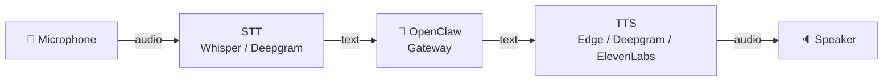
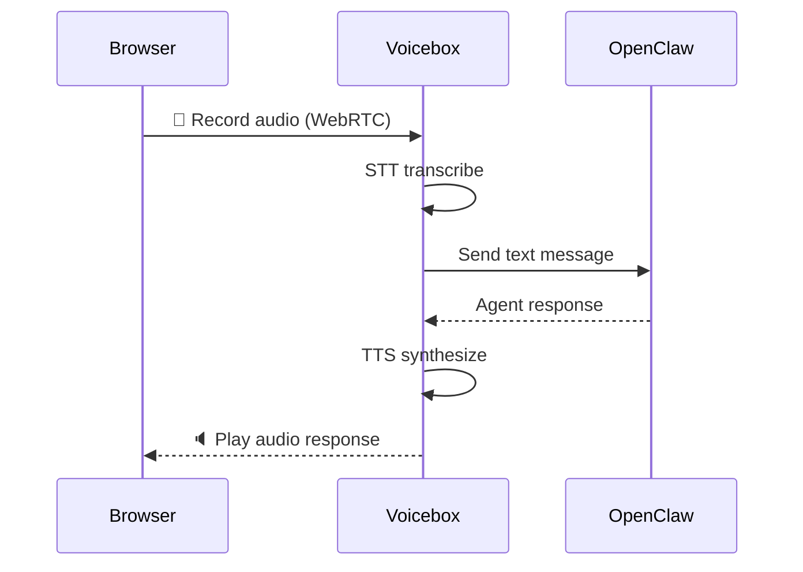
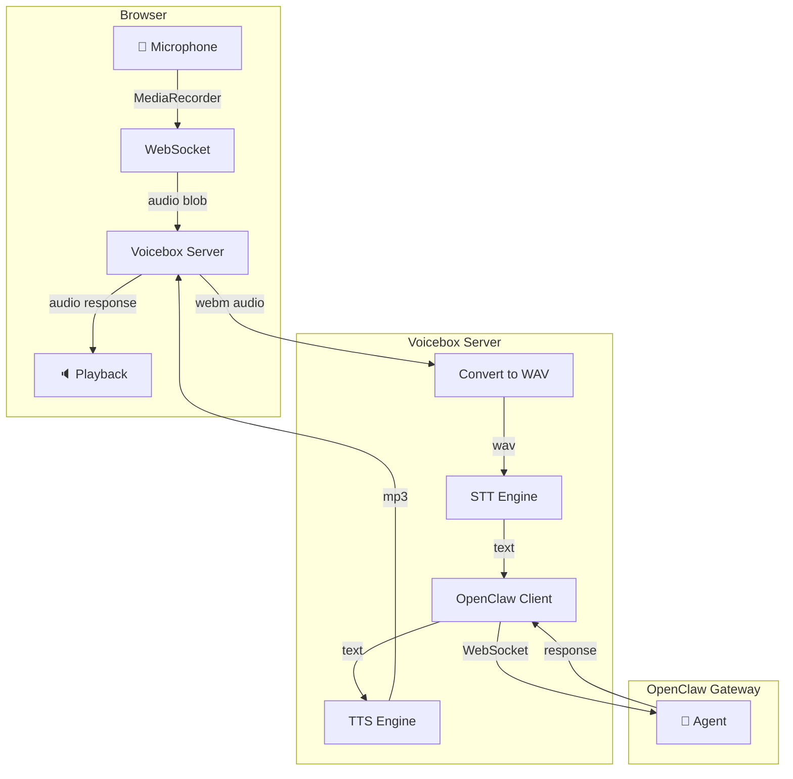

# 🗣️ Claw Voicebox

**Give your OpenClaw agent a voice.**

A Dockerized voice pipeline that lets [OpenClaw](https://github.com/openclaw/openclaw) agents communicate with humans through natural speech. Includes a browser-based WebRTC interface and CLI mode.

Built by an OpenClaw agent, for OpenClaw agents.

## Architecture



## Web Interface



## Quick Start

```bash
git clone https://github.com/ArisMontclair/claw-voicebox.git
cd claw-voicebox
cp .env.example .env
# Edit .env with your OpenClaw gateway token
docker compose up --build
```

Open **http://localhost:8080** — click the microphone, talk to your agent.

## Connecting Remotely

The web UI runs on port 8080. To access it securely from anywhere:

```bash
# 1. Point a domain to your server (DNS A record)
# 2. Use Caddy for automatic SSL (easiest):
echo "voice.yourdomain.com {
    reverse_proxy localhost:8080
}" | sudo tee /etc/caddy/Caddyfile
sudo systemctl restart caddy

# 3. Access at https://voice.yourdomain.com
```

See [docs/reverse-proxy.md](docs/reverse-proxy.md) for Nginx and Traefik options.

## Supported Providers

### Speech-to-Text
| Provider | Latency | Cost | Best For |
|---|---|---|---|
| **Whisper** | ~1-3s | Free (local) | Privacy, offline |
| **Deepgram Nova-3** | ~150-300ms | ~$0.0043/min | Speed |

### Text-to-Speech
| Provider | Latency | Cost | Best For |
|---|---|---|---|
| **Edge TTS** | ~500ms | Free | No setup needed |
| **Deepgram Aura** | ~100-200ms | ~$0.004/1K chars | Speed |
| **ElevenLabs** | ~200-400ms | ~$0.30/1K chars | Quality |

## Configuration

### 🆓 Free (no API keys)
```env
STT_PROVIDER=whisper
TTS_PROVIDER=edge
OPENCLAW_TOKEN=your-gateway-token
```

### ⚡ Fastest (Deepgram)
```env
STT_PROVIDER=deepgram
TTS_PROVIDER=deepgram
DEEPGRAM_API_KEY=your-key
OPENCLAW_TOKEN=your-gateway-token
```

### 🎭 Best Quality
```env
STT_PROVIDER=deepgram
DEEPGRAM_API_KEY=your-key
TTS_PROVIDER=elevenlabs
ELEVENLABS_API_KEY=your-key
OPENCLAW_TOKEN=your-gateway-token
```

See `.env.example` for all options.

## Running Modes

### Web UI (default)
```bash
docker compose up
# Opens browser-based voice interface on port 8080
```

### CLI (microphone directly)
```bash
docker compose run claw-voicebox pipeline
# Or without Docker:
python pipeline.py
```

### Process a single audio file
```bash
docker compose run claw-voicebox pipeline /path/to/audio.wav
# Or:
python pipeline.py audio.wav
```

## How It Works



## Project Structure

```
claw-voicebox/
├── web_server.py      # FastAPI web server + WebSocket + browser UI
├── pipeline.py        # CLI pipeline (mic → STT → OpenClaw → TTS → speaker)
├── Dockerfile
├── docker-compose.yml
├── .env.example       # All configuration options
├── docs/
│   └── reverse-proxy.md   # Caddy / Nginx / Traefik setup
└── README.md
```

## Contributing

Contributions welcome — especially:
- Additional STT/TTS providers
- Latency optimizations
- Mobile/PWA support
- Multi-language support

## License

MIT
